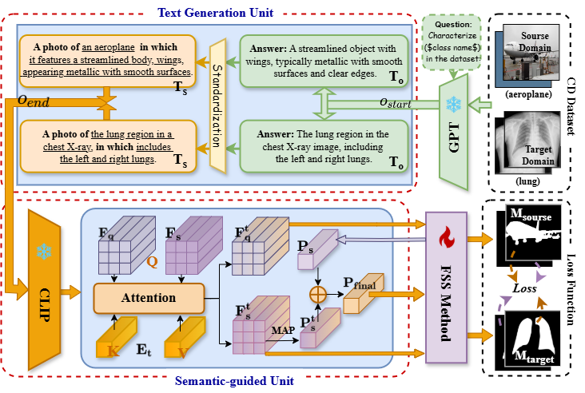
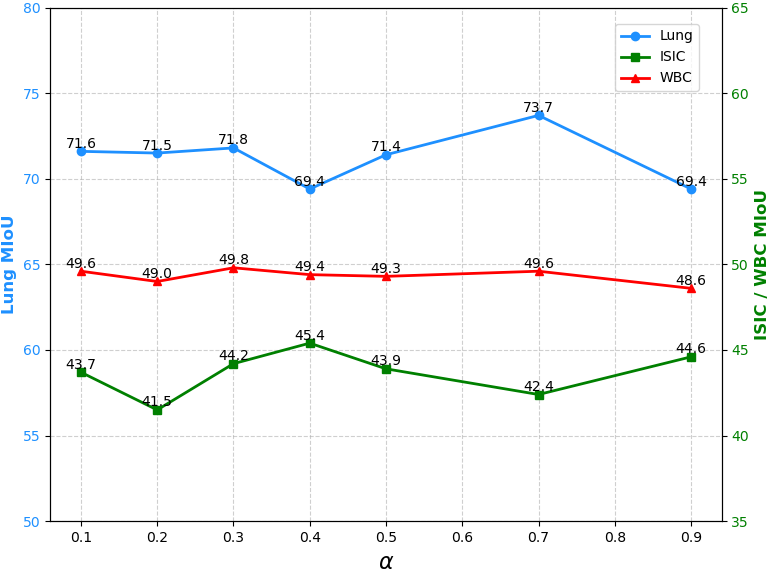

# Leveraging Language to Generalize Natural Images to Few-shot Medical Image Segmentation

This is the implementation of the paper "Leveraging Language to Generalize Natural Images to Few-shot Medical Image Segmentation". For more information, check out the [\[paper\]]().

## Introduction
Cross-domain Few-shot Medical Image Segmentation (CD-FSMIS) typically involves pre-training on a large-scale source domain dataset (e.g., natural image dataset) before transferring to a target domain with limited data for pixel-wise segmentation. However, due to the significant domain gap between natural images and medical images, existing Few-shot Segmentation (FSS) methods suffer from severe performance degradation in cross-domain scenarios. We observe that using only annotated masks as cross-domain cues is insufficient, while rich textual information can effectively establish knowledge relationships between visual instances and language descriptions, mitigating domain shift. To address this, we propose a plug-in Cross-domain Text-guided (CD-TG) module that leverages text-domain alignment to construct a new alignment space for domain generalization. This plug-in module consists of two components, including: (1) Text Generation Unit that utilizes the GPT-4 question-answering system to generate standardized category-level textual descriptions, and (2) Semantic-guided Unit that aligns visual and linguistic support feature embeddings while incorporating existing mask information. We integrate this plug-in module into five mainstream FSS methods and evaluate it on four widely used medical image datasets. Experimental results demonstrate its effectiveness. 

<p align="middle">
    
</p>
We study the CD-FSS problem, where the source and target domains have completely disjoint label space and cannot access target domain data during the training stage. 

## Clip Weights
 Download Clip-Weights from [[Google Drive](https://drive.google.com/drive/folders/1BICJ2kXZe0TtgB9PrUNJRfE3IaPF_fJR?usp=sharing)]

## Datasets
The following datasets are used for evaluation in CD-FSS:

### Source domain: 

* **PASCAL VOC2012**:

    Download PASCAL VOC2012 devkit (train/val data):
    ```bash
    wget http://host.robots.ox.ac.uk/pascal/VOC/voc2012/VOCtrainval_11-May-2012.tar
    ```
    Download PASCAL VOC2012 SDS extended mask annotations from [[Google Drive](https://drive.google.com/file/d/10zxG2VExoEZUeyQl_uXga2OWHjGeZaf2/view?usp=sharing)].
  
* **MSCOCO2012**:

    Download MS COCO 2012 dataset (train/val data):
    ```bash
    wget http://images.cocodataset.org/zips/train2012.zip
    wget http://images.cocodataset.org/zips/val2012.zip
    ```
    Download MS COCO 2012 annotations and segmentation masks:
    ```bash
    wget http://images.cocodataset.org/annotations/annotations_trainval2012.zip
    wget http://images.cocodataset.org/annotations/annotations_trainval2012.zip
    ```


### Target domains: 

* **ISIC2018**:

    Home: http://challenge2018.isic-archive.com

    Direct (must login): https://challenge.isic-archive.com/data#2018
    
    Class Information: data/isic/class_id.csv

* **Chest X-ray**:

    Artical: https://www.ncbi.nlm.nih.gov/pmc/articles/PMC4256233/

    Direct: https://www.kaggle.com/datasets/nikhilpandey360/chest-xray-masks-and-labels
  
* **WBC**:

    Artical: https://www.sciencedirect.com/science/article/pii/S0968432817303037

    Direct: https://github.com/zxaoyou/segmentation_WBC

* **CHAOS-MRI**:

    Artical: http://www.sciencedirect.com/science/article/pii/S1361841520303145

    Direct: [Combined Healthy Abdominal Organ Segmentation data set](https://chaos.grand-challenge.org/)

## Requirements

- Python 3.7
- PyTorch 1.5.1
- cuda 10.1
- tensorboard 1.14
- open-clip
- peft

Conda environment settings:
```bash
conda create -n cdtg python=3.7
conda activate cdtg

conda install pytorch=1.5.1 torchvision cudatoolkit=10.1 -c pytorch
conda install -c conda-forge tensorflow
pip install tensorboardX open-clip peft
```

## Hyperparameterization and Visualization
<p align="middle">
    
    
</p>
The above experiments are built on the baseline model PATNet.

The line graph illustrates the effect of varying α values (representing text contribution) on the MIoU of three datasets: Lung, ISIC, and WBC. The left y-axis represents the MIoU of the Lung dataset, while the right y-axis displays the MIoU values for the ISIC and WBC datasets. The MIoU of the Lung dataset fluctuates between 69.4 and 73.7, with the highest value observed at α = 0.7 (73.7). The MIoU of the ISIC dataset remains in the range of 41.5 to 45.4, showing less sensitivity to changes in α. The WBC dataset remains relatively stable, with MIoU values ranging from 49.0 to 49.8. Each data point is labeled with the corresponding MIoU value to provide a clearer view of the model's performance at different α values. The legend distinguishes the three datasets, facilitating easy comparison of their trends. Overall, there is a nonlinear relationship between the model’s performance and the α hyperparameter values.

For this set of visualizations, some segmentation examples were selected from each of the four datasets: Lung, ISIC, WBC, and MRI. Each dataset displays the original image with a mask (ground truth, baseline and our predicted) superimposed to highlight the segmented regions.

## References

[1] Shen Q, Li Y, Jin J, et al. Q-net: Query-informed few-shot medical image segmentation[C]//Proceedings of SAI Intelligent Systems Conference. Cham: Springer Nature Switzerland, 2023: 610-628.

[2] Yang B, Liu C, Li B, et al. Prototype mixture models for few-shot semantic segmentation[C]//Computer Vision–ECCV 2020: 16th European Conference, Glasgow, UK, August 23–28, 2020, Proceedings, Part VIII 16. Springer International Publishing, 2020: 763-778.

[3] Lei S, Zhang X, He J, et al. Cross-domain few-shot semantic segmentation[C]//European conference on computer vision. Cham: Springer Nature Switzerland, 2022: 73-90.

[4] Chen J, Quan R, Qin J. Cross-domain few-shot semantic segmentation via doubly matching transformation[J]. arXiv preprint arXiv:2405.15265, 2024.

[5] Nie J, Xing Y, Zhang G, et al. Cross-domain few-shot segmentation via iterative support-query correspondence mining[C]//Proceedings of the IEEE/CVF Conference on Computer Vision and Pattern Recognition. 2024: 3380-3390.

